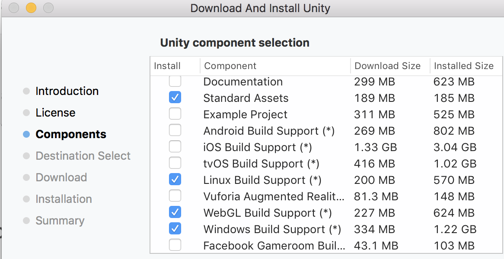

# FCND Simulator Development

## Download Unity

This document details development for the simulator:

Download Unity, the recommended version is [2017.3.0p3](https://unity3d.com/unity/qa/patch-releases?version=2017.3). Later versions should be fine. 

In the options make sure you have Linux, MacOS, Windows and WebGL build support.



## Clone The Repo

Download [Git LFS](https://git-lfs.github.com/) prior to cloning the repo, depending on the git version this may not be required.

Clone the repo:

```
git lfs clone https://github.com/udacity/FCND-Simulator.git
```

This may take a while go grab a coffee :)

Once it's done, open up Unity and open repo folder. Unity will load all the files everything should be good to go.

## Scenes

Scenes can be found and should be saved to the [Scenes](./Assets/Scenes/) directory.

The base scene is Backyard Flyer, which has the Unity file name [`urban`](./Assets/Scenes/urban.unity). Other scenes build off the components of this scene. Exploring this scene and all the components will provide a solid grasp of the functionality.

## Code

Most of the code is in the [Scripts directory](./Assets/Scripts). Notable Subdirectories are:

- [DroneInterface](./Assets/Scripts/DroneInterface) - Interface specification for a `Drone`. The Drone interface is split into three separate parts: DroneVehicle, DroneSensor, DroneController/DroneAutopilot.
- [Drones](./Assets/Scripts/Drones) - Concrete implementations of `DroneInterface`.
- [DroneVehicles](./Assets/Scripts/DroneVehicles) - Used to control the vehicle actuators/motors (i.e. arming motors, setting actuators/motors), set vehicle properties, and return true vehicle state information. 
- [DroneControllers](./Assets/Scripts/DroneControllers) - Low-level drone controllers. Functionality provided mainly by an autopilot. Takes in sensor/state information from the DroneVehicle/DroneSensor and passes along commands to the DroneVehicle. Different modes are set using MovementBehaviors.
- [DroneSensors](./Assets/Scripts/DroneSensors) - Simulator flight sensors (GPS, imu, barometer, etc.). Takes in the true state from DroneVehicle and transforms them into noisey sensor measurements.- [Menu](./Assets/Scripts/Menu) - UI elements for the main menu.
- [FlightUtils](./Assets/Scripts/FlightUtils) - Utility functions for conversions, reference frames, etc.
- [Messaging](./Assets/Scripts/Messaging) - Serialize/deserialize messages.
- [Networking](./Assets/Scripts/Networking) - Infra for sending and receiving messages from clients.
- [Projects](./Assets/Scripts/Projects) - Project file scripts. Scenes will be based off one of these files.
- [UI](./Assets/Scripts/UI) - UI elements for the ground control station (GCS).

## Quadcopter Specific Development
Currently, the quadcopter moves by adding a thrust force in upward body frame and three moments in the body frame in QuadVehicle. These moments are sent by QuadAutopilot(previously SimpleQuadController). Thrust/Moment commands can also be passed thru directly from offboard (Python Udacidrone). QuadVehicle also controls the rotor spinning visualization.

## Fixed Wing Specific Development
The fixed wing simulator is still in development so much of the same functionality available in the Quadcopter simulation is not ready yet. We are currently using the uSim library to simulate the aerodynamics. The PlaneVehicle class is a wrapper for the vehicle functionality provided by the uSim library. 